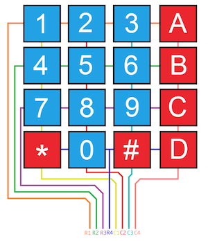
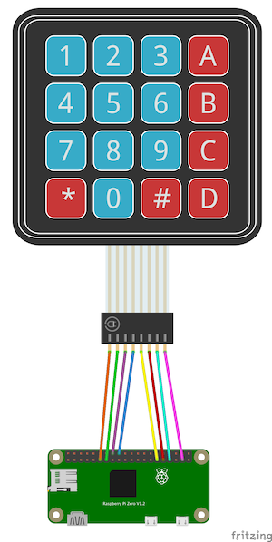

# Setup

A keypad is split into interconnected `rows` and `columns`. Typically, you will have a connection for each.
So a 4x4 keypad has 4 `row` and `4` columns with a totaly of `8` pins required to interact with it. For more specific information,
I'd actually recommend reading over the [Parallax 4x4 Membrane Keypad Datasheet](https://www.parallax.com/sites/default/files/downloads/27899-4x4-Matrix-Membrane-Keypad-v1.2.pdf)
which goes a little more in depth. I'll also be using from images from that datasheet here.

## Pin Setup

Wiring the keypad is fairly simple. You'll need to know which pins correspond to the `rows` and `columns` and their order. In almost every case, it is like the image below with `Row 1` starting on the far left and `Column 1` being the wire directly after the last row.

Remember that _order matters_ here. When specifying the `:row_pins` option for `keypad`, the first item in the list needs to correspond with the first row on the keypad, i.e. `use Keypad, row_pins: [5,6,7]` would mean `GPIO5` maps to `Row 1`, `GPIO6` maps to `Row 2`, etc etc.

An example pinout connected to a raspberry pi using the default pins would be:

## Using External Resistors

COMING SOON

I want to test a bit before I put something out here that might lead people astray and fry boards.

`keypad` is setting the row pins with the internal `PULL_UP` resistor. On keypress, that causes the pin to go `LOW` and it detects that falling edge. If that gets you going to wiring then 👌. Otherwise, check back soon after I've done a little more testing.